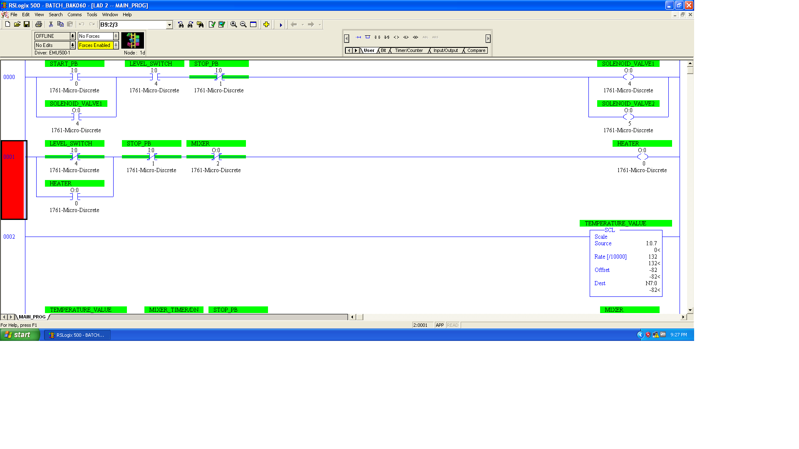
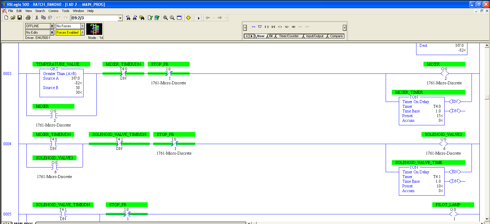

# Batch Mixing Sequence Control System

## Project Overview
This repository contains a functional PLC ladder logic program designed for an automated batch process using Allen-Bradley MicroLogix architecture. The system safely manages material input, analog scaling, a timed mixing cycle, and controlled fluid discharge via automated valves.

## Engineering Logic Breakdown
The control software relies on event-driven state sequencing and strict safety interlocking:

1. **System Latching & Interlocks:** Uses standard seal-in rungs to initiate operations via `START_PB`, requiring active sensor feedback before energizing output solenoids or heating elements.
2. **Data Manipulation & Scaling:** Incorporates a Scale (`SCL`) block to process raw analog input data from plant instrumentation into engineering units.
3. **Conditional Execution:** Employs a Greater Than (`GRT`) block to dynamically monitor process thresholds. Once the scaled variable clears the setpoint, the sequence triggers an on-delay timer (`TON`) to manage the precise mixing timeline.

---

## Control Logic Architecture

### 1. Process Initiation and Heating Interlocks
This section shows the initial latching networks handling the startup cycle and element interlocks.

### 2. Analog Scaling & Sequenced Mixing Timers
This section demonstrates the conversion of the process variable and the dynamic activation of the mixer timer loops once parameters are satisfied.

---

## System Configuration
- **Processor Platform:** Allen-Bradley MicroLogix / 1761 Micro-Discrete
- **Development Environment:** RSLogix 500 / Virtual Workstation Deployment
- **Instruction Set Utilized:** Bit interfaces (XIC, XIO, OTE), Data Conversion (SCL), Relational Compare (GRT), Timers (TON)
